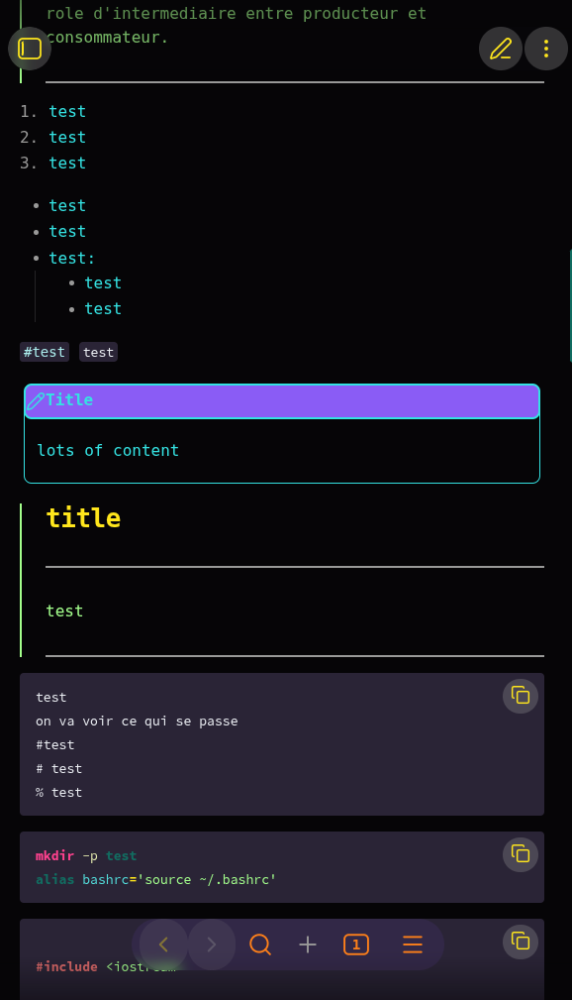
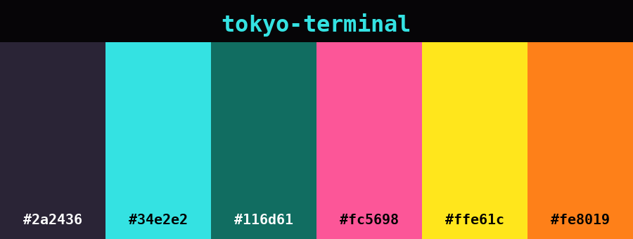

# Tokyo Terminal

```shin'en
   /$$            /$$            /$$     /$$$$$$$$$$      
  | $$/$$    /$$$$$$$$$$$$      /$$  /$$ |_______/$$      
   \/ $$    | $$__ $$__ $$     /$$  /$$      /$$/$$$      
   / $$     | $$  \$$  \$$    /$$$$$$$ /$$$$$$$$$$$$$$$   
  / $$ $$   | $$$$$$$$$$$$   |___/$$$  |___/$$$$\____ /   
/ $$ $$ \$$ | $$__ $$__ $$      /$$/ /$$   |__\$$$ /$$/   
|__/ $$ |_/ | $$$$$$$$$$$$    /$$$$$$$$$$ \$$$_$$$\$$/    
   | $$     | $$_| $$__ $$   /$$______/ \$|___/$$/$$$\    
   | $$     |__/ | $$  |_/   |/$$ |$$ \$$//$$$$$$|$$$\    
   | $$          | $$        /$$/ |$$  \$$\_/$$$/ |$$$_   
   |__/          |__/        |_/  |_/   \/|$$$$/   \$$$   
```

-----------------------------------------
## Description
-----------------------------------------

---
### Short Description (for marketplace/extension metadata)

```plaintext
Tokyo Terminal is a neon, high-contrast Obsidian theme inspired by a retrofuturist 80s terminal aesthetics, and Tokyo electric nights. Built for clarity and vibrancy, with maximum visual efficiency.
```

---
### Long README Introduction

**Welcome to *tokyo-terminal***, an Obsidian theme that transports your editor to a neon-colored terminal circa 1984.
This isn’t just a color scheme; it’s a high-contrast, high-energy workspace for writers and storytellers who crave **clarity and visual accentuation**.

Transform Obsidian into a neon-lit, retro-futurist terminal with high-contrast colors and synthwave accents inspired by Tokyo electric nights aesthetics.

Apply crisp cyan on deep purple and near-black backgrounds, with hot pink, sunset orange, gold and deep violet highlights for syntax and UI.

#### Design Philosophy

Inspired by the **hypnotic color glow of vintage CRTs**, the **hyper-saturated dreams of synthwave**, *vibrancy of outrun nostalgia*, tokyo-terminal is a love letter to the 80s colors scheme as I reimagined, restylized and modernized them.
Think of **synths, oversaturated consoles**, a world of outrun sunsets and cyber alleyways, just free of VHS static and CRT noise. With a nod to Taki Ono’s neon design photography, this theme merges retro-futurism with modern clarity.

Aiming for a holistic environment theme, *tokyo-terminal* delivers:
- **Bold readability**: Crisp **cyan (#34e2e2)** syntax on deep **purple (#2a2436)** and **near-black (#060507)** backgrounds.
- **Electric accents**: Highlighted keywords, functions, and UI in **Hot pink (#FF418E)**, **sunset orange (#FE8019)** buttons, **gold (#FFE61C)**, and **deep violet (#6C18D6)** animations.
- **Retro-futuristic contrast**: Designed to reduce eye strain while keeping items *visually alive* — like a mainframe in a cybercafé circa 1984.
- **Minimalist efficiency** grit meets glamour.

For developers/writers nostalgic of the future. For those who conceptualize like the future depends on it (Because it does).

-----------------------------------------
## Palette
-----------------------------------------

| Color           | Hex       | Usage                                                                       |
|---              |---        |---                                                                          |
| Black           | `#060507` | Darkest Background for text and coding                                      |
| Magenta         | `#2a2436` | Lighter Background for teminals and UI, also semi-hidden backreturn/separators signs and null values |
| BrightCyan      | `#34e2e2` | Main text, Object and classes names, section names in conf                  |
| Cyan            | `#116d61` | Types, Header 4                                                             |
| Red             | `#fc5698` | Accents, functions and method names, Titles                                 |
| BrightYellow    | `#ffe61c` | Keywords, Header 1                                                          |
| Yellow          | `#fe8019` | FDunction calls, buttons, expandvars, Header 2                              |
| BrightMagenta   | `#8b5cf6` | Activity/hover accent, Header 3                                             |
| BrightGreen     | `#A3FF8C` | Strings, hashtags                                                           |
| Green           | `#7fff00` | Comments in some languages, math symbols in KaTeX                           |
| BrightRed       | `#FF3B3B` | Errors and Bool = false                                                     |
| Blue            | `#3465a4` | Links                                                                       |
| BrightBlue      | `#0285f9` | Rarely used super accent, Header 6                                          |
| BrightWhite     | `#ECEFF4` | Plaintext, code symbols                                                     |
| BrightBlack     | `#999988` | Comments in some languages, punctuation, Header 5                           |
| White           | `#ACEEEE` | Variables in code                                                           |
| +oldRed         | `#d66666` | Metaprocessors and loaders                                                  |
| +Pink           | `#F1ADFF` | Decimal numbers in code, unresolved boolean, `this` keyword when in italic                 |
| +Gold           | `#E3E9AE` | Property keys in yaml & json files, arguments                               |

-----------------------------------------
## ToDo
-----------------------------------------

- [x] Published Obsidian version
- [x] Publishied VS Codium version on the marketplace
- [ ] Publishing VS Code version on the marketplace
- [ ] Find KaTeX devs and ask them to add an align tag resetter
- [ ] Publish Licence to SPDX
- [ ] Review port to Firefox
- [ ] Port to Chrome
- [x] Fixed code sections color to match usual tokyo-terminal conventions
- [x] Correction of button transparency as --color-foreground impacting the color for the blue buttons
- [ ] I cannot catch back the Table title head bottom border anymore, neither change the background to purple in second choice. thead and tr should be the right objects but to no avail.
- [x] Main screen triple options is gray instead of orange on mobile
- [ ] I wanted the note edit toolbar with different markup tags automatic injection to be made of orange colored buttons but I cannot find the variables.
- [x] Accentuation color choice through --color-accent usages. Mostly in purple but not hover colors.
- [x] Menu that opens above the notes list does not have a background set on menu items
- [ ] Internal link hovering should be purple or blue and without underline. Both types hover in cyan for now and I could not figure out how to overcome that behavior
- [ ] Verify all languages in embedded code: renders and tokens
- [x] Use `this.app.emulateMobile(true);` for a mobile devmode
<br><br>

> Do not hesitate to drop me a line on GitHub if you spot an issue, see more tweaks and like the color scheme.

-----------------------------------------
## Screenshots
-----------------------------------------




---
**Made by 神縁 in 2026 under TSLST License**
[GitHub](https://github.com/TSLST)
[Mastodon](https://mastodon.social/@TSLST) Even though I don't actually like Mastodon